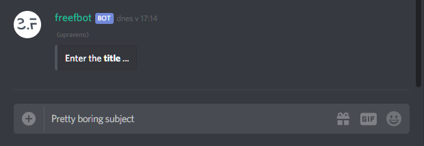
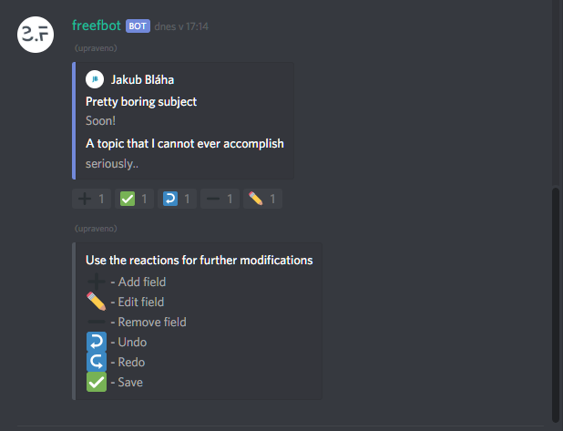
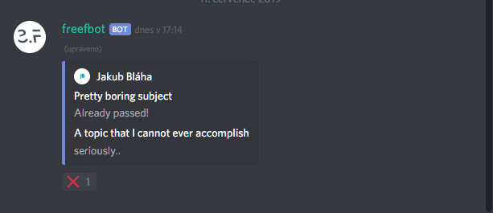
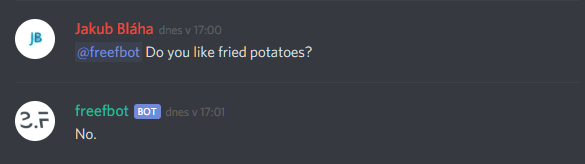
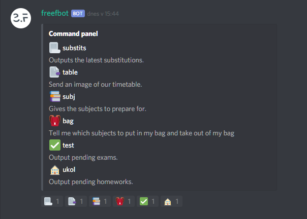
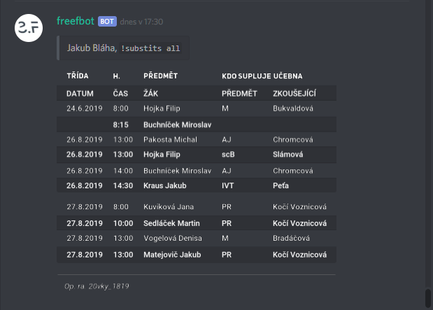
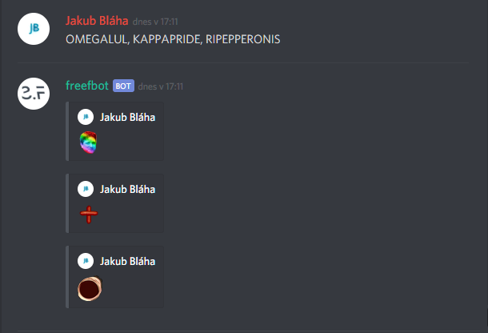

# freefbot


A simple discord bot made for personal purposes in python using [discord.py](https://github.com/Rapptz/discord.py). This bot is focused on class discord servers for students, however can be easily modified for your own purposes.

## Setup
There is no public server hosting this bot, therefore you need to run it yourself on your RPi or something. Follow the instructions below.

 - Register your discord bot and get a API token at https://discordapp.com/developers/applications/
 - Install **Python 3.7** and `pipenv` if you haven't already.
 - Clone the project.
```bash
git clone https://github.com/JakubBlaha/freefbot.git
```
 - Create the [`config.yaml`](#the-local-config) file with your API key and the [`config`](#the-remote-config) channel in your discord server as shown below. 
 - Setup the virtual environment.
 ```bash
 cd freefbot
 pipenv install
 ```
 - Activate the virtual environment and run the bot.
 ```bash
 pipenv shell
 python3.7 client.py
 ```

Now go ahead and enjoy the super-feature-rich discord bot. 😁


## Features
**Available commands:**

Command|Action
-------|------
`!eval`|Evaluate a python expression.
`!random`|Give a random number.
`!repeat`|Repeat the given message.
`!table`|Send the timetable.
`!subj`|Output the subjects to prepare for.
`!bag`|Output which subjects to take out and put in your bag.
`!substits`|Output the coming substitutions.
`!exam`|Output exams from the `exam_channel_id` channel.
`!hw`|Output homeworks from the `homework_channel_id` channel.
`!embed`|Build/edit an embed
more ..| 🎆 🌟 🎇 ⭐ ✨

## Usage
### The local config
There needs to be a `config.yaml` file in the root folder with some critical information.
```yaml
token: ...
guild_id: ...
presence: Hello world!  # The text that will be shown as playing a game
status: online          # A string representing an attribute of the discord.Status class

# Logging
disable_logs: False
log_channel_id: ...
channel_log_flush_interval: 10

# Command specific
username: ...           # moodle username
password: ...           # moodle password
```

### The remote config
The remote config feature allows to store the bot configuration in a separate discord channel named `config` in the *yaml* format. Only the last message will be considered. An example content of such a message can be found below.

```yaml
# General
locale: en-us  # The locale that will be used for various purposes

# The Control Panel
control_panel_channel_id: ...

# The auto Reactor
auto_reactor_channel_ids: [...]
auto_reactor_reaction_ids: [...]

# The !table command
timetable_url: https://www.example.com

# The !substits command
substits_col_indexes: [...]       # Considered columns
substits_headers: [...]           # Custom table headers
substits_replace_contents: {...}  # Pairs of original -> replaced keywords in the table
```

### The embed builder
The bot contains an embed builder which can build new and edit existing embeds in a user-friendly way. Only few commands and message reactions are used in the process.

**Commands**
  - `new` - The bot will kindly ask for the required information and build an embed based on the information provided.
  - `edit` - A group of subcommands used to edit an existing embed. The syntax of the subcommand is `!embed edit [embed index] [subcommand] [value]`. An embed index has to be passed right before any of the subcommand. The index is counted from *0* and includes only the embeds, but no messages containing no embeds. `title`, `url`, `description`, `color`, `footer` and `fields` subcommands are available.
  
    All of the subcommands require an actual value to be passed after the subcommand as already stated, *except* the `fields` subcommand, which will guide you through the process.

    The following actions are available during the field editing.

    Reaction | Action
    ---------|-------
    ➕ | Add field
    ✏ | Edit field
    ➖ | Remove field
    ↩ | Undo
    ↪ | Redo
    ✅ | Save


**Examples**
> Editing the title of the *most recent* embed title to `My awesome title`.
```
!embed edit 0 title My awesome title
```
> Editing the embed fields of the *second most recent* embed.
```
!embed edit 1 fields
```
We can also use aliases for the subcommands. For example `t` will become `title`, `d` `description`, etc. Note that the alias for the `footer` subcommand is `foo` and not `f`, since that one is for `fields`. A full list of aliases can be retrieved by either of these commands.
```
!help embed edit
!embed edit
```


>Setting an embed title was never easier


>At least creating the embed is fun!

### The Embed excluder
The *Embed excluder* will add the ❌ reaction to any outdated embed found in channels with the 🔔 emoji in their topic. Can be used as a sort of a indicator to remove outdated embeds more easily.


>Pretty late to remove the embed actually ☺

### The Cleverbot integration
This feature is just for fun, anything else. Simply tag the bot in your message and tell him something dumb. 


>Pretty need, heh?

### The Command panel
The Command panel is a feature, which provides the ability to execute commands more easily. That is done clicking the reaction. All the messages generated in this channel will be deleted after one minute.


>Access your timetable more easily

*The Command panel is a channel-specific feature, so use it in a dedicated channel only.*

### The Event notifier
The Event notifier will periodically scan each channel having the 🔔 emoji in it's topic every 10 minutes and edit the `general` channel's description so it contains a summary of all of the scanned embeds.


>I would forget, if my bot didn't tell me. Really. 😉

### The `!substits` command
The table scraper is a sort of a personal feature, but can be easily modified if needed. The scraper downloads a pdf file from moodle, extracts a table from it and sends the data as a set of constructed images. All of the configuration but the *username* and *password*, which are stored in the *local config*, are stored in the *remote config*.


>Never have to go through the long process of downloading the pdf again. Have it nice and easy here!

### The Twitch Client
The twitch client watches for messages with emote names in them and replaces them with their actual images using discord embeds. If the emoji names is the only content of the message, the message will be deleted.


>What would be the point of our gamer lifes without them?